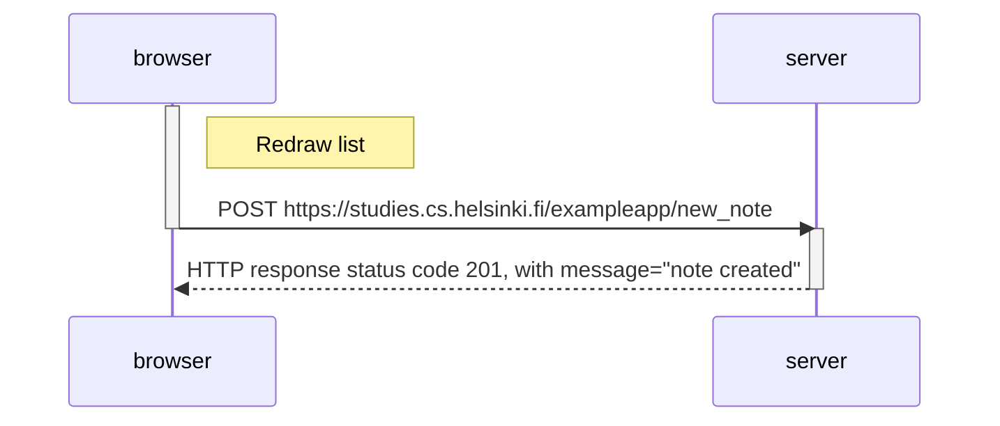

```mermaid
sequenceDiagram
    participant browser
    participant server

    activate browser
    Note right of browser: Redraw list
    

    browser->>server: POST https://studies.cs.helsinki.fi/exampleapp/new_note
    deactivate browser
    activate server
    server-->>browser: HTTP response status code 201, with message="note created"
    deactivate server

```